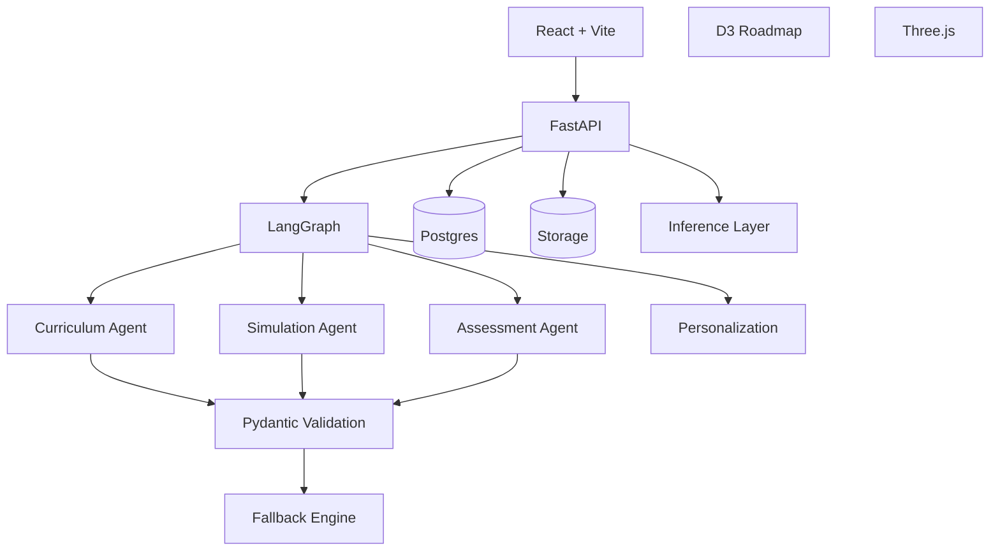
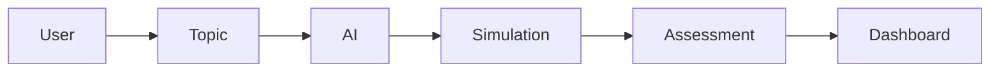
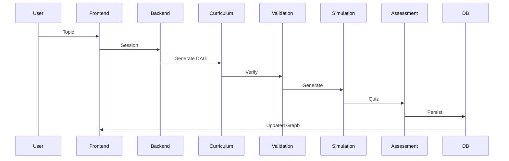

<div align="center">
          
          ███╗   ██╗███████╗██╗   ██╗██████╗  ██████╗ ██████╗  █████╗ ████████╗██╗  ██╗
          ████╗  ██║██╔════╝██║   ██║██╔══██╗██╔═══██╗██╔══██╗██╔══██╗╚══██╔══╝██║  ██║
          ██╔██╗ ██║█████╗  ██║   ██║██████╔╝██║   ██║██████╔╝███████║   ██║   ███████║
          ██║╚██╗██║██╔══╝  ██║   ██║██╔══██╗██║   ██║██╔═══╝ ██╔══██║   ██║   ██╔══██║
          ██║ ╚████║███████╗╚██████╔╝██║  ██║╚██████╔╝██║     ██║  ██║   ██║   ██║  ██║
          ╚═╝  ╚═══╝╚══════╝ ╚═════╝ ╚═╝  ╚═╝ ╚═════╝ ╚═╝     ╚═╝  ╚═╝   ╚═╝   ╚═╝  ╚═╝
          
          N E U R O P A T H
        Autonomous Adaptive Learning OS

</div>

# Adaptive Simulation Learning.  
### Built for understanding, not memorization.

<div align="center">


</div>

---

# Why NeuroPath Exists

Most learning systems assume every learner should follow the same path.

Read.
Watch.
Advance.

NeuroPath rejects that assumption.

NeuroPath transforms technical learning into a closed adaptive loop:

**Learn → Simulate → Validate → Adapt**

Instead of generating lessons, NeuroPath generates **structured understanding**.

Topics become prerequisite graphs.  
Concepts become simulations.  
Mistakes become rerouted learning paths.

---

# Live Preview

| Experience | Access |
|---|---|
| Demo | `Live Interactive Session` |
| Docs | `Architecture + API` |
| Architecture | `Agent System` |
| Presentation | `Hackathon Deck` |
| Video | `Product Walkthrough` |
| GitHub | `Source Code` |

---
# Architecture


<div align="center">
  
</div>

<p align="center">
Structured AI Outputs • Multi-Agent Orchestration • Adaptive Learning Loop
</p>
<!--  -->


# Showcase

## Landing

```txt
Input Goal
↓
Generate Roadmap
↓
Launch Simulation
````

Intelligent entry into adaptive learning.

---

## Roadmap

```txt
Graph Basics
↓
Weighted Edges
↓
Relaxation
↓
Dijkstra
```

Dynamic prerequisite DAG generation.

---

## Simulation

Interactive Three.js visual execution.

---

## Assessment

Micro-checkpoints after interaction.

---

## Dashboard

Visible mastery progression.

---

# The Problem

Traditional systems break because:

❌ Static content
❌ Fixed progression
❌ Weak remediation
❌ No simulation
❌ Delayed feedback

Result:

```txt
Read
↓
Forget
↓
Repeat
```

---

# Our Approach

```txt
Topic
 ↓
AI Curriculum
 ↓
Roadmap
 ↓
Simulation
 ↓
Assessment
 ↓
Adaptation
```

Every interaction changes the path.

---

# Key Features

| Capability         | Description                       |
| ------------------ | --------------------------------- |
| Adaptive Roadmaps  | Dynamic prerequisite DAG          |
| Simulation Engine  | JSON → Three.js rendering         |
| AI Assessment      | Real-time mastery checks          |
| JWT Progress       | Session persistence               |
| Analytics          | Learning telemetry                |
| 3D Rendering       | Interactive concept exploration   |
| Multi-Agent System | Coordinated educational reasoning |

---

# Architecture



---

# AI Agents

| Agent           | Purpose    | Input       | Output  | Logic      |
| --------------- | ---------- | ----------- | ------- | ---------- |
| Orchestrator    | Control    | Session     | State   | Route      |
| Curriculum      | DAG        | Topic       | Graph   | Dependency |
| Simulation      | Scene      | Node        | JSON    | Template   |
| Assessment      | Checkpoint | Interaction | Quiz    | Evaluate   |
| Personalization | Adapt      | Behavior    | Update  | Recovery   |
| Analytics       | Insights   | Events      | Metrics | Observe    |

---

# Tech Stack

## Frontend

React
Vite
D3.js
Three.js

## Backend

FastAPI
LangGraph
SQLAlchemy
Pydantic

## AI

Groq
Llama

## Infra

Postgres
Redis

## Data

JSON
Schema Validation

---

# Product Flow



---

# Folder Structure

```bash
frontend/
backend/
agents/
infra/
docs/

frontend/
 ├── pages/
 ├── components/
 ├── simulations/

backend/
 ├── api/
 ├── orchestration/
 ├── validation/

agents/
 ├── curriculum/
 ├── simulation/
 ├── assessment/
```

---

# Getting Started

```bash
git clone repo

cd neuropath

npm install

npm run dev
```

```bash
cp .env.example .env
```

```bash
python seed.py
```

---

# System Design



---

# Benchmarks

| Metric           | Target |
| ---------------- | ------ |
| First Simulation | <30s   |
| Path Generation  | <2s    |
| Validation       | >85%   |
| Rendering        | <1.5s  |

---

# Why This Is Different

|             |   LMS | AI Tutors | NeuroPath |
| ----------- | ----: | --------: | --------: |
| Adaptive    |     △ |         ✓ |         ✓ |
| Simulation  |     ✗ |         ✗ |         ✓ |
| Assessment  | Basic |    Medium |   Dynamic |
| Rerouting   |     ✗ |         ✗ |         ✓ |
| Multi-Agent |     ✗ |         ✗ |         ✓ |

---

# Roadmap

## Now

Adaptive loop.

## Next

Template expansion.

## Future

Persistent mastery.

---

# Contributing

```bash
fork

branch

commit

pr
```

Quality > velocity.

---

# Team

| Role     | Domain      |
| -------- | ----------- |
| Product  | Learning    |
| Frontend | Interaction |
| Backend  | Systems     |
| AI       | Agents      |

---

# License

MIT

---

<div align="center">

Learning should not adapt to systems.

Systems should adapt to learners.

</div>
```
